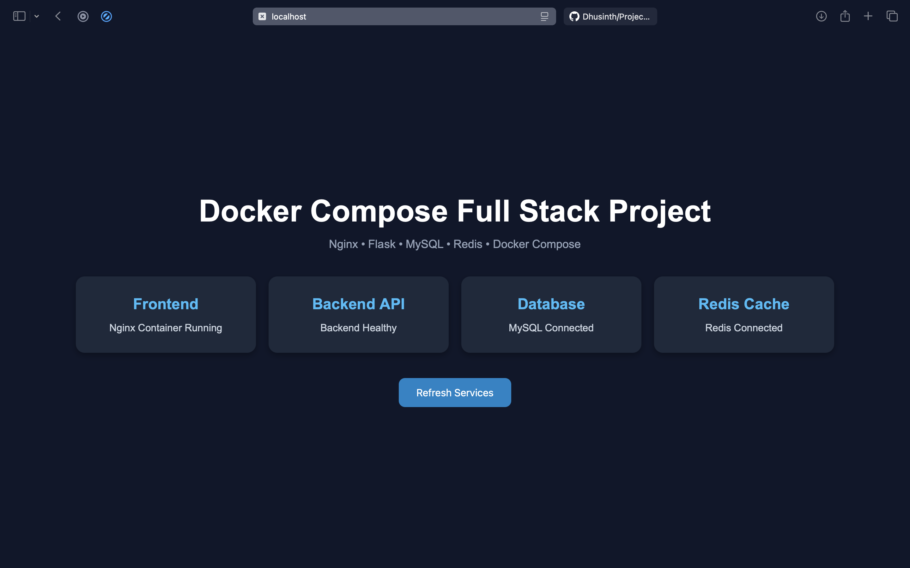
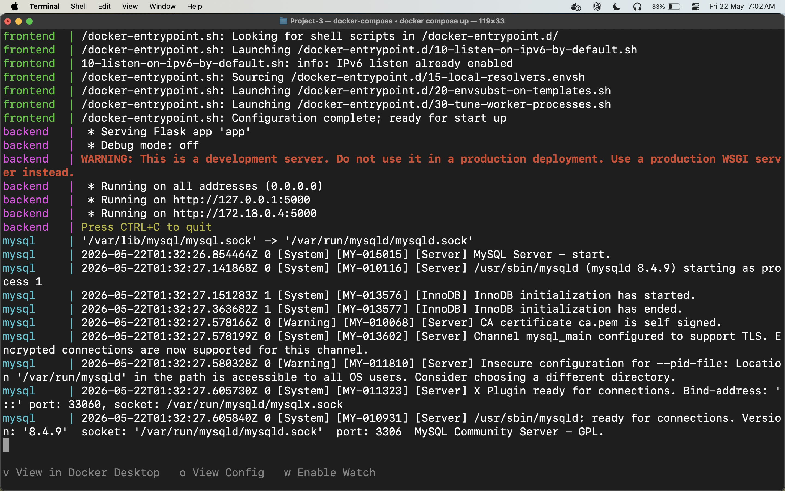
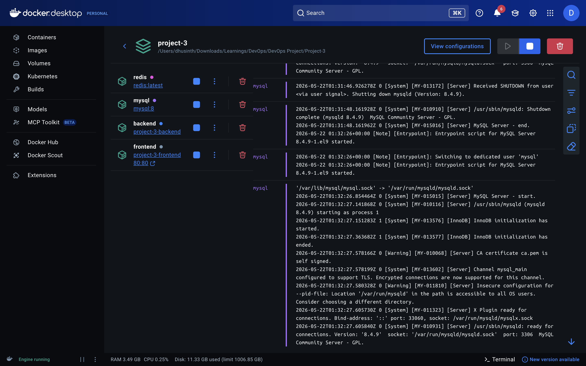

# 🚀 Docker Compose Full Stack Project

A multi-container full stack application built using Docker Compose with Nginx, Flask, MySQL, and Redis.

This project demonstrates container orchestration, Docker networking, reverse proxy configuration, backend API communication, database integration, and Redis caching using Docker Compose.

---

# 📌 Project Architecture

Frontend (Nginx) → Backend API (Flask) → MySQL + Redis

---

# 🛠 Tech Stack

- Docker
- Docker Compose
- Nginx
- Flask
- MySQL
- Redis
- Python

---

# ✨ Features

✅ Multi-container orchestration using Docker Compose  
✅ Docker networking and service discovery  
✅ Nginx reverse proxy setup  
✅ Flask REST API backend  
✅ MySQL database integration  
✅ Redis cache integration  
✅ Persistent database storage using Docker Volumes  
✅ Environment variable based configuration  
✅ Service-to-service communication using Docker internal DNS  

---

# 📂 Project Structure

```bash
Project3-Docker-Compose-FullStack/
│
├── frontend/
│   ├── index.html
│   ├── style.css
│   ├── script.js
│   ├── Dockerfile
│   └── nginx.conf
│
├── backend/
│   ├── app.py
│   ├── requirements.txt
│   └── Dockerfile
│
├── docker-compose.yml
├── README.md
└── .gitignore
```

---

# ⚙️ Docker Compose Services

## Frontend
- Nginx container
- Serves static frontend files
- Acts as reverse proxy to backend API

## Backend
- Flask API container
- Handles API requests
- Connects to MySQL and Redis

## MySQL
- MySQL 8 container
- Persistent storage using Docker volumes

## Redis
- Redis container
- Used for caching and fast in-memory storage

---

# 🌐 Docker Networking

This project uses custom Docker networks:

```yaml
networks:
  frontend-net:
  backend-net:
```

### frontend-net
Used for communication between:
- Frontend container
- Backend container

### backend-net
Used for communication between:
- Backend container
- MySQL container
- Redis container

Docker Compose automatically provides internal DNS resolution using service names.

Example:

```yaml
MYSQL_HOST: mysql
REDIS_HOST: redis
```

The backend container can communicate with MySQL and Redis using service names instead of IP addresses.

---

# 🔄 Reverse Proxy Configuration

Nginx forwards API requests to the backend container.

Example:

```nginx
location /api/ {
    proxy_pass http://backend:5000/;
}
```

This allows frontend requests to reach the Flask backend internally through Docker networking.

---

# 💾 Persistent Storage

MySQL data is stored using Docker Volumes.

```yaml
volumes:
  mysql-data:
```

This prevents database data loss even if containers are recreated.

---

# ▶️ Running The Project

## Clone Repository

```bash
git clone https://github.com/YOUR_USERNAME/Project3-Docker-Compose-FullStack.git
```

---

## Navigate To Project

```bash
cd Project3-Docker-Compose-FullStack
```

---

## Build And Start Containers

```bash
docker compose up --build
```

---

# 🌍 Access Application

Open browser:

```bash
http://localhost
```

---

# 📸 Screenshots

## Application UI

Add screenshot here:

```markdown

```

---

## Docker Compose Running Containers

```markdown

```

---

## Docker Desktop Containers

```markdown

```

---

# 📚 Key Learnings

During this project, I learned:

- Docker Compose fundamentals
- Multi-container orchestration
- Docker networking
- Reverse proxy configuration
- Service discovery using Docker DNS
- Container communication
- Persistent storage with volumes
- Backend API integration
- Debugging containerized applications
- Nginx configuration troubleshooting

---

# 🔥 API Endpoints

## Health Check

```bash
/api/health
```

---

## Database Check

```bash
/api/db-check
```

---

## Redis Check

```bash
/api/redis-check
```

---

# 🧠 Important Concepts Learned

| Concept | Description |
|---|---|
| Docker Networks | Communication between containers |
| Reverse Proxy | Nginx forwarding requests |
| Docker DNS | Service-name based communication |
| Docker Volumes | Persistent data storage |
| Multi-container Architecture | Frontend + Backend + Database |
| Environment Variables | Runtime configuration |

---

# 🚀 Future Improvements

- Add authentication
- Add Redis caching logic
- Add CI/CD pipeline
- Deploy to Kubernetes
- Deploy on AWS ECS/EKS
- Add monitoring using Prometheus & Grafana

---

# 👨‍💻 Author

Dhusinth

---

# ⭐ Support

If you liked this project, consider giving it a star ⭐ on GitHub.